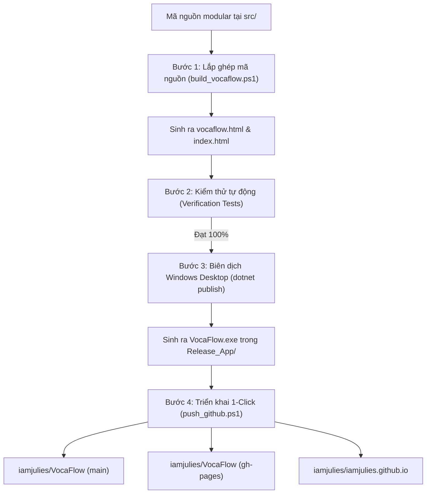

# 🚀 HƯỚNG DẪN KIỂM THỬ VÀ TRIỂN KHAI TOÀN DIỆN (TESTING & DEPLOYMENT SPEC)
> **Dự án**: VocaFlow - Hệ Thống Học & Ghi Nhớ Từ Vựng Tiếng Anh Thông Minh  
> **Áp dụng từ phiên bản**: `v0.10.9-alpha-7` trở đi  
> **Đối tượng áp dụng**: Nhà phát triển (Developer), Quản trị viên dự án, AI Agent tiếp quản  

---

## 📌 1. NGUYÊN TẮC VÀ TRIẾT LÝ VẬN HÀNH (CORE PRINCIPLES)

1. **Nguyên Tắc "Chia Để Trị" (Separation of Concerns)**:
   - Mã nguồn phát triển được tổ chức theo module tại thư mục `src/`:
     - `src/components/`: Chứa các thành phần giao diện rời (header, màn hình học, modal cài đặt, modal VIP...).
     - `src/scripts/app.js`: Chứa toàn bộ logic ứng dụng, thuật toán Spaced Repetition, Anti-Time-Travel, Flow Freeze, đồng bộ Firebase RTDB.
     - `src/styles/`: Chứa định kiểu CSS giao diện.
     - `src/app_template.html`: Khung sườn HTML chuẩn bị cho việc lắp ghép.
   - ⚠️ **TUYỆT ĐỐI KHÔNG SỬA TRỰC TIẾP** vào file `vocaflow.html` hoặc `index.html`. Mọi thay đổi phải thực hiện trong `src/`, sau đó chạy script lắp ghép tự động.

2. **Nguyên Tắc 7 Điểm Nhất Quán Phiên Bản (7-Point Version Consistency)**:
   Mỗi khi nâng version mới (ví dụ: `v0.10.9-alpha-7`), bắt buộc đồng bộ tại 7 vị trí sau:
   - [x] `src/components/header.html` (Thẻ nhãn `.brand-version`)
   - [x] `src/components/modals/modal-settings.html` & `src/scripts/app.js` (`#settings-app-version-label` & `VOCAFLOW_APP_VERSION`)
   - [x] `sw.js` (Hằng số `CACHE_NAME`)
   - [x] `Release_App/sw.js` (Hằng số `CACHE_NAME`)
   - [x] `VocaFlow_Desktop/Program.cs` (Thuộc tính `Text` tiêu đề cửa sổ)
   - [x] `VOCAFLOW_OVERVIEW.txt` & `GITHUB_RELEASE/VOCAFLOW_OVERVIEW.txt` (Dòng tiêu đề & Mục II)
   - [x] `GITHUB_RELEASE/push_github.ps1` (Tên file ZIP phát hành & Commit message)

---

## 🛠️ 2. QUY TRÌNH 4 BƯỚC KIỂM THỬ & TRIỂN KHAI CHUẨN MỰC



---

### 🔹 BƯỚC 1: LẮP GHÉP MÃ NGUỒN TỰ ĐỘNG (BUILD & ASSEMBLY)

Script `build_vocaflow.ps1` có nhiệm vụ đọc template và ghép toàn bộ mã nguồn module trong `src/` thành một file HTML duy nhất (Single-File Offline-First).

* **Lệnh thực thi**:
  ```powershell
  powershell -ExecutionPolicy Bypass -File .\build_vocaflow.ps1
  ```
* **Cơ chế hoạt động**:
  1. Đọc file `src/app_template.html`.
  2. Nạp và thay thế `<!-- INJECT:STYLES -->` từ các file `.css` trong `src/styles/`.
  3. Nạp và thay thế `<!-- INJECT:ICONS -->` từ `src/components/icons/`.
  4. Nạp và thay thế `<!-- INJECT:HEADER -->` từ `src/components/header.html`.
  5. Nạp và ghép `<!-- INJECT:SCREENS -->` từ `src/components/screens/*.html`.
  6. Nạp và ghép `<!-- INJECT:MODALS -->` từ `src/components/modals/*.html`.
  7. Nạp và thay thế `<!-- INJECT:SCRIPTS -->` từ `src/scripts/app.js`.
  8. Ghi đè tệp tin đích `vocaflow.html` và `index.html` tại thư mục gốc (~38.500 dòng, ~2.3 MB).
  9. Đồng bộ vào `Release_App/vocaflow.html` và `GITHUB_RELEASE/`.

---

### 🔹 BƯỚC 2: KIỂM THỬ TỰ ĐỘNG (AUTOMATED VERIFICATION)

Trước khi đóng gói hoặc đẩy code, bắt buộc phải chạy bộ kiểm tra tự động để đảm bảo không xảy ra hồi quy lỗi (regression).

* **Lệnh thực thi**:
  ```powershell
  powershell -ExecutionPolicy Bypass -File .\test_suite.ps1
  ```
* **Nội dung kiểm tra bắt buộc (Tối thiểu 19 tiêu chí)**:
  1. `[PASS]` Đã xóa bỏ các khối mã debug cũ trừ oan Flow Freeze (`vocaflow_freeze_deducted_v0108_debug06`).
  2. `[PASS]` Hàm tự phục hồi `healErroneousFreezeDeduction` tồn tại và được đăng ký lúc nạp trang.
  3. `[PASS]` Hệ thống Anti-Time-Travel Engine đầy đủ biến số (`serverTimeDeltaMs`, `STORAGE_KEY_MAX_OBSERVED_TIME`).
  4. `[PASS]` Hàm `isSystemClockManipulatedBackward()` phát hiện đồng hồ máy bị chỉnh lùi.
  5. `[PASS]` Hàm `syncTrustedServerTimeFromHeader()` bóc tách chính xác header Date từ Google Firebase RTDB.
  6. `[PASS]` Hàm `recordStudyFlowAction()` chặn ghi nhận streak nếu ngày học nhỏ hơn `maxObservedDate`.
  7. `[PASS]` Hàm `isAuthorVipUser()` và `initGlobalVipRegistry()` kiểm tra hạn dùng thực tế `vipExpiresAt > now`.
  8. `[PASS]` Hàm `stripVipAffixes()` gọt sạch vương miện `👑` khỏi tên khi hết hạn VIP.
  9. `[PASS]` `renderPublicProfileModal()` hiển thị huy hiệu chuẩn `🌟 Tác Giả Đóng Góp` (không bao giờ hiện `👑 VIP Hết hạn`).
  10. `[PASS]` `evaluateAndAutoApplyFlowFreezes()` không bao giờ trừ freeze nếu ngày hôm qua người dùng đã học.
  11. `[PASS]` Nhãn phiên bản tại `header.html` khớp chính xác version hiện tại.
  12. `[PASS]` Nhãn phiên bản tại `modal-settings.html` khớp chính xác version hiện tại.
  13. `[PASS]` Tên cache trong `sw.js` và `Release_App/sw.js` khớp chính xác version hiện tại.
  14. `[PASS]` Tiêu đề cửa sổ trong `Program.cs` khớp chính xác version hiện tại.
  15. `[PASS]` File `VOCAFLOW_OVERVIEW.txt` có bản ghi nhật ký phát hành đúng số hiệu Build.
  16. `[PASS]` Tệp `vocaflow.html` sau lắp ghép chứa đầy đủ các tính năng mới nhất.

---

### 🔹 BƯỚC 3: BIÊN DỊCH ỨNG DỤNG WINDOWS DESKTOP (DESKTOP BINARY COMPILATION)

Dự án sử dụng .NET 8 Windows Forms nhúng Microsoft Edge WebView2 để chạy ứng dụng độc lập, siêu nhẹ và bảo mật trên hệ điều hành Windows.

* **Lệnh biên dịch (Release x64)**:
  ```powershell
  dotnet publish .\VocaFlow_Desktop\VocaFlow.csproj -c Release -r win-x64 --self-contained false -o .\Release_App
  ```
* **Yêu cầu kiểm tra sau khi biên dịch**:
  - Tệp nhị phân `Release_App\VocaFlow.exe` được tạo mới thành công (Exit Code = 0, 0 lỗi biên dịch).
  - Các thư viện phụ thuộc tồn tại đầy đủ: `Microsoft.Web.WebView2.Core.dll`, `Microsoft.Web.WebView2.WinForms.dll`, `runtimes\win-x64\native\WebView2Loader.dll`.
  - Tệp giao diện `Release_App\vocaflow.html`, `Release_App\sw.js`, `Release_App\manifest.json` và thư mục `icons/`, `audio/` đã được đồng bộ mới nhất từ bước 1.

---

### 🔹 BƯỚC 4: PHÁT HÀNH 1-CLICK LÊN GITHUB (1-CLICK MULTI-DEPLOY)

Script `GITHUB_RELEASE/push_github.ps1` thực hiện tự động hóa 100% công đoạn đóng gói tệp ZIP và đẩy code lên toàn bộ các môi trường trực tuyến.

* **Lệnh thực thi**:
  ```powershell
  powershell -ExecutionPolicy Bypass -File .\GITHUB_RELEASE\push_github.ps1
  ```
* **Trình tự tự động thực hiện**:
  1. **Nén bản Portable ZIP**:
     - Tạo thư mục tạm, sao chép toàn bộ `Release_App/`.
     - Nén thành `VocaFlow_vX.X.X_Windows_Portable.zip` và lưu vào `GITHUB_RELEASE/` và thư mục gốc.
  2. **Đẩy lên `iamjulies/VocaFlow` (Nhánh `main`)**:
     - Lưu trữ toàn bộ mã nguồn, tài liệu, bộ kiểm thử và gói phát hành ZIP.
  3. **Đẩy lên `iamjulies/VocaFlow` (Nhánh `gh-pages`)**:
     - Triển khai trang web tĩnh phục vụ người dùng PWA tại: `https://iamjulies.github.io/VocaFlow/`.
  4. **Đẩy lên `iamjulies/iamjulies.github.io` (Nhánh `main`)**:
     - Cập nhật trang web gốc của người dùng tại: `https://iamjulies.github.io/`.

---

## 📊 3. BẢNG TRA CỨU FILE VÀ LỆNH NHANH

| Hạng mục | Tệp tin / Thư mục chính | Lệnh thực thi / Ghi chú |
| :--- | :--- | :--- |
| **Mã nguồn modular** | `src/components/`, `src/scripts/app.js` | Nơi duy nhất chỉnh sửa tính năng & giao diện |
| **Lắp ghép file** | `build_vocaflow.ps1` | `powershell -File .\build_vocaflow.ps1` |
| **Kiểm thử tự động** | `test_suite.ps1` | `powershell -File .\test_suite.ps1` |
| **Biên dịch EXE** | `VocaFlow_Desktop/` -> `Release_App/` | `dotnet publish VocaFlow_Desktop -c Release -r win-x64 -o Release_App` |
| **Phát hành 1-Click** | `GITHUB_RELEASE/push_github.ps1` | `powershell -File .\GITHUB_RELEASE\push_github.ps1` |
| **Live PWA URL** | Web GitHub Pages | [https://iamjulies.github.io/VocaFlow/](https://iamjulies.github.io/VocaFlow/) |
| **Root Web URL** | GitHub Personal Site | [https://iamjulies.github.io/](https://iamjulies.github.io/) |

---

## ⚠️ 4. CHECKLIST AN TOÀN DỮ LIỆU DÀNH CHO AI AGENT TIẾP QUẢN

> 1. **KHÔNG BAO GIỜ** sửa thẳng vào `vocaflow.html` hoặc `index.html`. Sửa ở `src/` rồi chạy `build_vocaflow.ps1`.
> 2. **KHÔNG BAO GIỜ** dùng mảng rỗng `{}` để ghi đè `followers` hoặc `following` lên Firebase Cloud khi thiết bị mới khởi chạy (tham khảo chi tiết tại `MANDATORY_UPDATE_WORKFLOW.md`).
> 3. **KHÔNG BAO GIỜ** đẩy mã nguồn lên GitHub khi chưa chạy kiểm thử tự động và biên dịch `VocaFlow.exe`.